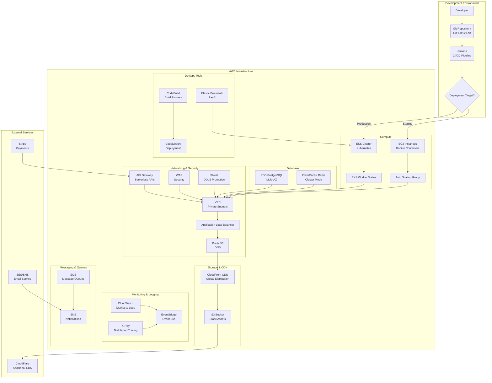

# AWS & DevOps Architecture for Learning Platform

## Architecture Diagram



## Component Descriptions

### Development Environment
- **Developer**: Team members working on the platform
- **Git Repository**: Source code management (GitHub/GitLab)
- **Jenkins**: CI/CD automation server with our shared library

### AWS Infrastructure Components

#### Compute Services
1. **EC2 Instances**: Virtual machines for staging environment running Docker containers
2. **EKS Cluster**: Production Kubernetes cluster for container orchestration
3. **Auto Scaling Group**: Automatically adjusts capacity based on demand
4. **EKS Worker Nodes**: EC2 instances that host Kubernetes pods

#### Database Services
1. **RDS PostgreSQL**: Managed PostgreSQL database with Multi-AZ for high availability
2. **ElastiCache Redis**: In-memory data store for caching and session management

#### Storage & Content Delivery
1. **S3 Bucket**: Object storage for static assets (images, videos, documents)
2. **CloudFront CDN**: Global content delivery network for low-latency access

#### Networking & Security
1. **Route 53**: DNS service for domain name resolution
2. **Application Load Balancer**: Distributes traffic across instances
3. **VPC**: Virtual private cloud for network isolation
4. **API Gateway**: Serverless API management (for specific microservices)
5. **WAF**: Web application firewall for security
6. **Shield**: Managed DDoS protection service

#### Monitoring & Logging
1. **CloudWatch**: Monitoring and observability service
2. **X-Ray**: Distributed tracing for microservices
3. **EventBridge**: Event bus for connecting applications

#### Messaging & Queues
1. **SQS**: Message queues for asynchronous communication
2. **SNS**: Notification service for alerts and messaging

#### DevOps Tools
1. **CodeBuild**: Managed build service (alternative to Jenkins)
2. **CodeDeploy**: Deployment automation service
3. **Elastic Beanstalk**: Platform-as-a-service for simplified deployments

### External Services
1. **Stripe**: Payment processing integration
2. **SES/SNS**: Email and SMS notification services
3. **CloudFlare**: Additional CDN and security services

## Deployment Pipeline Flow

### 1. Development Phase
1. Developers commit code to Git repository
2. Jenkins CI pipeline triggers automatically
3. Code is built, tested, and validated
4. Docker images are created for each microservice

### 2. Staging Deployment
1. Docker images are deployed to EC2 instances
2. Integration tests are performed
3. Manual validation by QA team
4. Performance testing and monitoring validation

### 3. Production Deployment
1. Approved images are deployed to EKS cluster
2. Kubernetes handles rolling updates
3. Health checks ensure service availability
4. Traffic is gradually shifted to new version

## DevOps Workflow with Jenkins Shared Library

Using the Jenkins shared library we created:

```groovy
// Frontend deployment
@Library('microservices-deployment') _
deployFrontend(
    registry: 'AWS ECR',
    environment: 'production'
)

// Backend microservices deployment
@Library('microservices-deployment') _
deployBackend(
    services: ['user-service', 'course-service'],
    registry: 'AWS ECR',
    environment: 'production'
)
```

## Security Considerations

1. **IAM Roles**: Least privilege access for all services
2. **VPC Isolation**: Private subnets for database and backend services
3. **Encryption**: At-rest and in-transit encryption for all data
4. **Secrets Management**: AWS Secrets Manager for sensitive configuration
5. **Security Groups**: Network access control at the instance level

## High Availability & Disaster Recovery

1. **Multi-AZ Deployment**: RDS and application services across availability zones
2. **Auto Scaling**: Dynamic capacity adjustment based on demand
3. **Load Balancing**: Traffic distribution across healthy instances
4. **Backup Strategy**: Automated backups for all critical data
5. **Cross-Region Replication**: S3 replication for disaster recovery

## Cost Optimization

1. **Spot Instances**: For non-critical staging workloads
2. **Reserved Instances**: For predictable production workloads
3. **S3 Lifecycle Policies**: Automated transition to cheaper storage tiers
4. **CloudWatch Alarms**: Automated scaling to optimize resource usage
5. **Lambda Functions**: For event-driven, serverless processing

This architecture provides a scalable, secure, and cost-effective solution for deploying the Learning Platform using AWS services and DevOps best practices.