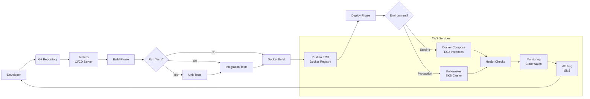

# DevOps Pipeline with AWS Services

## CI/CD Pipeline Architecture



## Pipeline Stages Details

### 1. Source Control Management
- **GitHub/GitLab**: Centralized code repository
- **Branch Strategy**: GitFlow or GitHub Flow
- **Webhooks**: Automatic pipeline triggers on code changes

### 2. Continuous Integration
Using our Jenkins shared library:

```groovy
// Jenkinsfile for backend services
@Library('microservices-deployment') _

pipeline {
    agent any
    
    stages {
        stage('Checkout') {
            steps {
                git branch: 'main', url: 'https://github.com/your-org/learning-platform.git'
            }
        }
        
        stage('Build Backend') {
            steps {
                deployBackend(
                    services: ['user-service', 'auth-service', 'course-service'],
                    registry: 'AWS ECR',
                    tag: "build-${BUILD_NUMBER}",
                    environment: 'staging'
                )
            }
        }
    }
}
```

### 3. Testing Strategy
- **Unit Tests**: Run with every build
- **Integration Tests**: Validate microservices communication
- **Contract Tests**: Ensure API compatibility
- **Security Scans**: Check for vulnerabilities

### 4. Containerization
- **Docker Images**: Built for each microservice
- **Multi-stage Builds**: Optimized image sizes
- **Image Scanning**: Security vulnerability checks
- **Tagging Strategy**: Semantic versioning with build numbers

### 5. Artifact Storage
- **AWS ECR**: Private Docker registry
- **Image Lifecycle**: Automated cleanup of old images
- **Cross-Region Replication**: For global deployments

### 6. Deployment Environments

#### Staging Environment
- **EC2 Instances**: Cost-effective compute
- **Docker Compose**: Simplified orchestration
- **Isolated VPC**: Separate from production
- **Automated Testing**: End-to-end validation

#### Production Environment
- **EKS Cluster**: Managed Kubernetes service
- **Helm Charts**: Application deployment management
- **Blue/Green Deployments**: Zero-downtime releases
- **Rollback Capability**: Quick recovery from failures

### 7. Monitoring & Feedback
- **CloudWatch**: Metrics and log aggregation
- **X-Ray**: Distributed tracing for microservices
- **SNS**: Notification service for alerts
- **Custom Dashboards**: Business and technical metrics

## Jenkins Shared Library Integration

### Frontend Deployment Pipeline
```groovy
@Library('microservices-deployment') _

deployFrontend(
    nodeVersion: '18',
    buildDir: 'dist',
    registry: 'AWS ECR',
    imageName: 'learning-platform/frontend',
    tag: "v1.0.${BUILD_NUMBER}",
    environment: 'production'
)
```

### Backend Services Pipeline
```groovy
@Library('microservices-deployment') _

deployBackend(
    nodeVersion: '18',
    services: ['user-service', 'auth-service', 'course-service', 'enrollment-service'],
    registry: 'AWS ECR',
    tag: "v1.0.${BUILD_NUMBER}",
    environment: 'production'
)
```

### Full Platform Deployment
```groovy
@Library('microservices-deployment') _

deployMicroservices(
    nodeVersion: '18',
    frontendBuildDir: 'dist',
    backendServices: [],
    registry: 'AWS ECR',
    tag: "release-${BUILD_NUMBER}",
    environment: 'production'
)
```

## AWS Service Integration Points

### Compute Services
1. **EC2 Auto Scaling**: Dynamic instance management
2. **EKS**: Container orchestration for production
3. **Lambda**: Serverless functions for event processing

### Storage Services
1. **S3**: Static asset storage
2. **EFS**: Shared file system for containers
3. **EBS**: Persistent block storage

### Database Services
1. **RDS**: Managed PostgreSQL database
2. **ElastiCache**: Redis caching layer
3. **DynamoDB**: NoSQL database for specific use cases

### Security Services
1. **IAM**: Identity and access management
2. **KMS**: Key management service
3. **Secrets Manager**: Secure credential storage

### Networking Services
1. **VPC**: Virtual private cloud
2. **Route 53**: DNS management
3. **CloudFront**: Content delivery network

## Deployment Strategies

### Blue/Green Deployment
1. Deploy new version to inactive environment
2. Test and validate new version
3. Switch traffic to new version
4. Decommission old version

### Rolling Updates
1. Gradually replace instances with new version
2. Maintain service availability during deployment
3. Monitor health during the process
4. Automatic rollback on failure

### Canary Releases
1. Deploy new version to small subset of users
2. Monitor performance and error rates
3. Gradually increase traffic percentage
4. Full rollout after validation

## Monitoring and Observability

### Metrics Collection
- **Application Metrics**: Response times, error rates
- **Infrastructure Metrics**: CPU, memory, disk usage
- **Business Metrics**: User registrations, course completions

### Log Management
- **Centralized Logging**: All services send logs to CloudWatch
- **Log Retention**: Configurable retention policies
- **Log Analysis**: Pattern detection and anomaly identification

### Alerting System
- **Threshold-based Alerts**: CPU usage, error rates
- **Anomaly Detection**: Unusual patterns in metrics
- **Notification Channels**: Email, SMS, Slack integration

This DevOps pipeline ensures reliable, automated deployments of the Learning Platform to AWS with proper monitoring and rollback capabilities.