# Microservices Architecture on AWS

## System Architecture Diagram

```mermaid
graph TB
    subgraph "Frontend Layer"
        A[React SPA<br/>Vite]
        B[Static Hosting<br/>S3 + CloudFront]
    end

    subgraph "API Gateway Layer"
        C[API Gateway<br/>NestJS]
    end

    subgraph "Microservices Layer"
        D[User Service<br/>Port 3001]
        E[Auth Service<br/>Port 3002]
        F[Course Service<br/>Port 3003]
        G[Enrollment Service<br/>Port 3004]
        H[Payment Service<br/>Port 3005]
        I[Media Service<br/>Port 3006]
        J[Notification Service<br/>Port 3007]
        K[Content Service<br/>Port 3008]
        L[Assessment Service<br/>Port 3009]
        M[Review Service<br/>Port 3010]
        N[Certificate Service<br/>Port 3011]
        O[Gamification Service<br/>Port 3012]
    end

    subgraph "AWS Infrastructure Services"
        P[RDS PostgreSQL<br/>Primary Database]
        Q[ElastiCache Redis<br/>Caching Layer]
        R[RabbitMQ<br/>ElasticMQ/SQS]
        S[S3 Bucket<br/>File Storage]
        T[SES<br/>Email Service]
        U[Stripe API<br/>Payment Processing]
        V[CloudWatch<br/>Monitoring]
    end

    subgraph "Deployment Orchestration"
        W[EKS Cluster<br/>Kubernetes]
        X[EC2 Instances<br/>Docker Hosts]
        Y[ECS<br/>Container Service]
    end

    A --> B
    B --> C
    C --> D
    C --> E
    C --> F
    C --> G
    C --> H
    C --> I
    C --> J
    C --> K
    C --> L
    C --> M
    C --> N
    C --> O
    
    D --> P
    E --> P
    F --> P
    G --> P
    H --> P
    I --> P
    J --> P
    K --> P
    L --> P
    M --> P
    N --> P
    O --> P
    
    D --> Q
    E --> Q
    F --> Q
    G --> Q
    H --> Q
    I --> Q
    J --> Q
    K --> Q
    L --> Q
    M --> Q
    N --> Q
    O --> Q
    
    D --> R
    E --> R
    F --> R
    G --> R
    H --> R
    I --> R
    J --> R
    K --> R
    L --> R
    M --> R
    N --> R
    O --> R
    
    I --> S
    J --> T
    H --> U
    V --> D
    V --> E
    V --> F
    V --> G
    V --> H
    V --> I
    V --> J
    V --> K
    V --> L
    V --> M
    V --> N
    V --> O
    
    W --> D
    W --> E
    W --> F
    W --> G
    W --> H
    W --> I
    W --> J
    W --> K
    W --> L
    W --> M
    W --> N
    W --> O
    
    X --> D
    X --> E
    X --> F
    X --> G
    X --> H
    X --> I
    X --> J
    X --> K
    X --> L
    X --> M
    X --> N
    X --> O
    
    Y --> D
    Y --> E
    Y --> F
    Y --> G
    Y --> H
    Y --> I
    Y --> J
    Y --> K
    Y --> L
    Y --> M
    Y --> N
    Y --> O
```

## Microservices Communication Patterns

### Synchronous Communication
- **REST APIs**: HTTP/JSON communication between services
- **gRPC**: High-performance RPC communication (future enhancement)
- **GraphQL**: Flexible query language for client requests

### Asynchronous Communication
- **Message Queues**: RabbitMQ/ElasticMQ for event-driven architecture
- **Event Streaming**: Apache Kafka for high-throughput event processing
- **Pub/Sub**: SNS for notification distribution

## Service Dependencies

### User Service
- **Database**: RDS PostgreSQL for user data
- **Cache**: ElastiCache Redis for session data
- **Messaging**: RabbitMQ for user events
- **Deployment**: EKS Pod

### Auth Service
- **Database**: RDS PostgreSQL for authentication data
- **Cache**: ElastiCache Redis for JWT tokens
- **Messaging**: RabbitMQ for auth events
- **External**: Stripe for payment user verification
- **Deployment**: EKS Pod

### Course Service
- **Database**: RDS PostgreSQL for course data
- **Cache**: ElastiCache Redis for course metadata
- **Messaging**: RabbitMQ for course events
- **Storage**: S3 for course assets
- **Deployment**: EKS Pod

### Enrollment Service
- **Database**: RDS PostgreSQL for enrollment data
- **Cache**: ElastiCache Redis for enrollment status
- **Messaging**: RabbitMQ for enrollment events
- **Deployment**: EKS Pod

### Payment Service
- **Database**: RDS PostgreSQL for transaction data
- **Cache**: ElastiCache Redis for payment status
- **Messaging**: RabbitMQ for payment events
- **External**: Stripe API for payment processing
- **Deployment**: EKS Pod

### Media Service
- **Database**: RDS PostgreSQL for media metadata
- **Cache**: ElastiCache Redis for media URLs
- **Messaging**: RabbitMQ for media events
- **Storage**: S3 for file storage
- **Deployment**: EKS Pod with EFS volume

### Notification Service
- **Database**: RDS PostgreSQL for notification templates
- **Cache**: ElastiCache Redis for notification status
- **Messaging**: RabbitMQ for notification events
- **External**: SES for email delivery
- **Deployment**: EKS Pod

## Data Flow Examples

### User Registration Flow
1. **Frontend**: User submits registration form
2. **API Gateway**: Routes request to Auth Service
3. **Auth Service**: Validates data and creates user in RDS
4. **Auth Service**: Publishes user.created event to RabbitMQ
5. **Notification Service**: Consumes event and sends welcome email via SES
6. **User Service**: Consumes event and creates user profile
7. **Response**: JWT token returned to frontend

### Course Enrollment Flow
1. **Frontend**: User clicks "Enroll" button
2. **API Gateway**: Routes request to Enrollment Service
3. **Enrollment Service**: Validates user and course, creates enrollment in RDS
4. **Enrollment Service**: Publishes enrollment.created event to RabbitMQ
5. **Payment Service**: Consumes event and initiates payment flow
6. **Notification Service**: Consumes event and sends enrollment confirmation
7. **Course Service**: Updates course enrollment count
8. **Response**: Enrollment confirmation returned to frontend

### Content Upload Flow
1. **Frontend**: Instructor uploads course content
2. **API Gateway**: Routes request to Media Service
3. **Media Service**: Stores file in S3 and metadata in RDS
4. **Media Service**: Publishes content.uploaded event to RabbitMQ
5. **Course Service**: Consumes event and updates course content
6. **Notification Service**: Sends content processing notification
7. **Response**: Upload confirmation returned to frontend

## Scalability Patterns

### Horizontal Scaling
- **EKS Pods**: Auto-scaling based on CPU/memory usage
- **RDS Read Replicas**: Offload read queries from primary database
- **Redis Clusters**: Distributed caching for high availability
- **Load Balancing**: ALB distributes traffic across instances

### Vertical Scaling
- **EC2 Instance Types**: Resize based on workload requirements
- **RDS Instance Classes**: Scale database capacity
- **Redis Node Sizes**: Adjust cache memory allocation

### Database Sharding
- **User Data**: Partitioned by user ID ranges
- **Course Data**: Partitioned by category or creation date
- **Enrollment Data**: Partitioned by course ID
- **Payment Data**: Partitioned by transaction date

## Fault Tolerance & Resilience

### Circuit Breaker Pattern
- **Implementation**: NestJS built-in circuit breaker
- **Monitoring**: Hystrix dashboard integration
- **Fallback**: Default responses for failed services

### Retry Logic
- **Exponential Backoff**: Gradually increase retry intervals
- **Jitter**: Randomize retry timing to prevent thundering herd
- **Dead Letter Queues**: Handle persistent message failures

### Health Checks
- **Liveness Probes**: Kubernetes container health
- **Readiness Probes**: Service availability status
- **Startup Probes**: Initialization completion status

### Graceful Degradation
- **Feature Flags**: Enable/disable functionality based on service health
- **Caching**: Serve cached responses when services are unavailable
- **Fallback UI**: Simplified interface when backend services fail

## Security Implementation

### Authentication
- **JWT Tokens**: Stateless authentication with expiration
- **Refresh Tokens**: Secure token renewal mechanism
- **OAuth 2.0**: Third-party authentication integration

### Authorization
- **Role-Based Access Control**: User roles and permissions
- **Attribute-Based Access Control**: Fine-grained permissions
- **API Key Management**: Service-to-service authentication

### Data Protection
- **Encryption at Rest**: RDS Transparent Data Encryption
- **Encryption in Transit**: TLS 1.3 for all communications
- **PII Handling**: Data anonymization and pseudonymization

### Network Security
- **VPC Isolation**: Private subnets for backend services
- **Security Groups**: Instance-level firewall rules
- **WAF Integration**: Web application firewall protection

## Monitoring & Observability

### Distributed Tracing
- **AWS X-Ray**: End-to-end request tracking
- **Correlation IDs**: Trace requests across services
- **Performance Metrics**: Latency and error rate monitoring

### Log Aggregation
- **CloudWatch Logs**: Centralized log management
- **Log Structure**: JSON format for easy parsing
- **Log Retention**: Configurable retention policies

### Metrics Collection
- **Application Metrics**: Custom business metrics
- **Infrastructure Metrics**: System-level performance data
- **Container Metrics**: Docker and Kubernetes metrics

### Alerting System
- **Threshold Alerts**: CPU, memory, and error rate thresholds
- **Anomaly Detection**: Machine learning-based anomaly detection
- **Notification Channels**: Email, SMS, and Slack integrations

This architecture provides a scalable, resilient, and secure foundation for the Learning Platform microservices deployed on AWS.