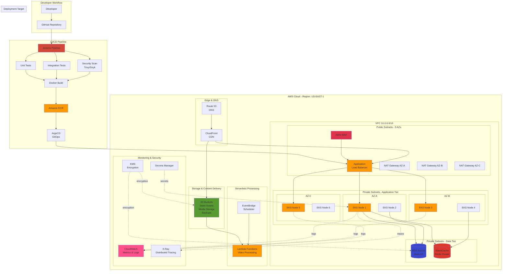
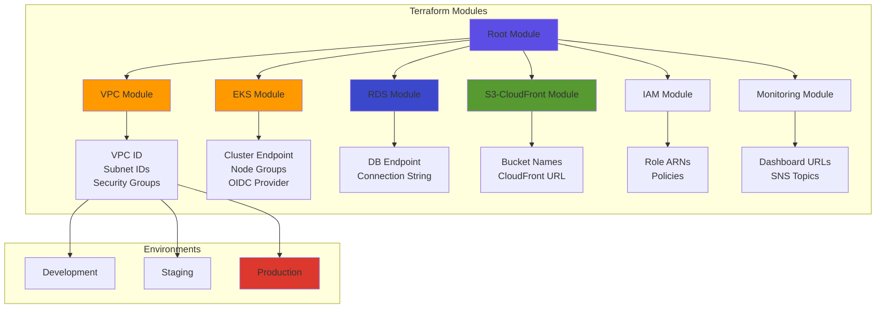
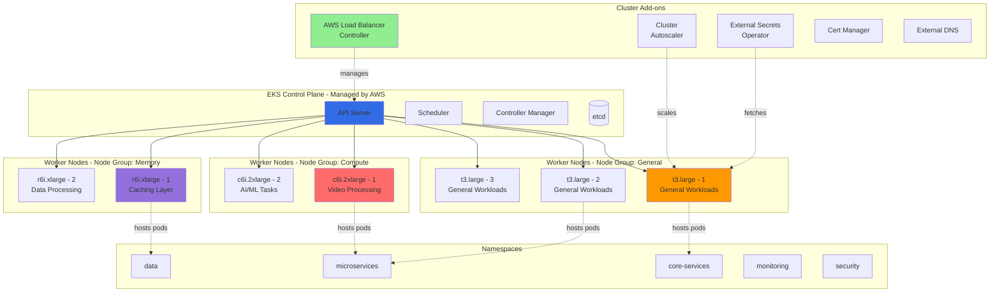
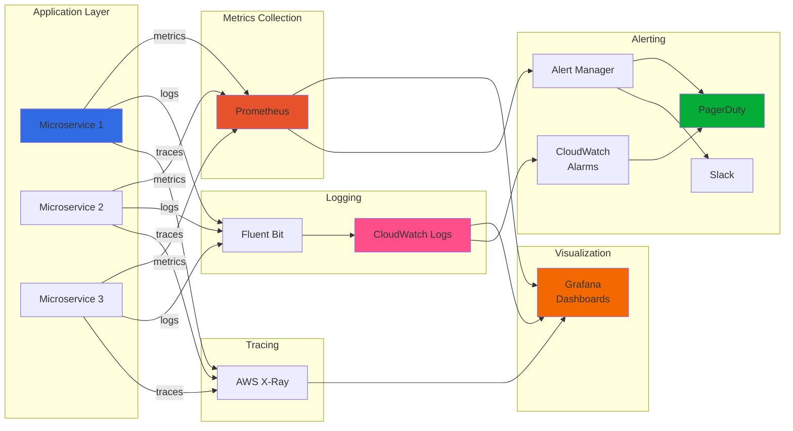
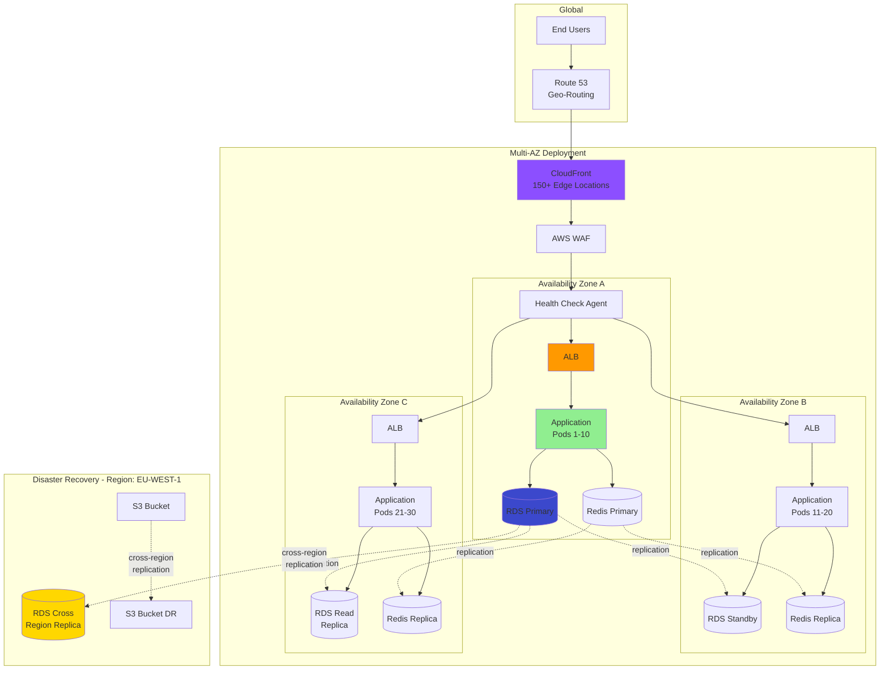

# AWS DevOps Engineer - Architecture Diagram

## Enterprise LMS Platform Architecture

## CI/CD Pipeline Details

```mermaid
graph LR
    subgraph "Source Control"
        A[Git Commit] --> B[GitHub Webhook]
    end
    
    subgraph "Build Stage"
        B --> C[Jenkins Triggered]
        C --> D[Checkout Code]
        D --> E[Install Dependencies]
        E --> F[Run Unit Tests]
        F --> G[Run Linting]
        G --> H[Security Scan]
    end
    
    subgraph "Container Stage"
        H --> I[Build Docker Image]
        I --> J[Scan Image - Trivy]
        J --> K[Tag Image]
        K --> L[Push to ECR]
    end
    
    subgraph "Deploy Stage"
        L --> M[Update Helm Values]
        M --> N[ArgoCD Sync]
        N --> O[Deploy to EKS]
        O --> P[Health Check]
        P --> Q[Smoke Tests]
    end
    
    subgraph "Notification"
        Q --> R{Success?}
        R -->|Yes| S[Slack Success]
        R -->|No| T[Slack Alert + Rollback]
    end
    
    style F fill:#90EE90
    style G fill:#90EE90
    style H fill:#FFA500
    style J fill:#FFA500
    style P fill:#87CEEB
    style S fill:#90EE90
    style T fill:#FF6B6B
```

## Infrastructure as Code Structure

## Kubernetes Cluster Architecture

## Monitoring & Observability Flow

## High Availability Architecture

---

## Legend

### Component Colors
- 🟠 **Orange** - AWS Compute & Core Services
- 🔵 **Blue** - Database Services
- 🟢 **Green** - Storage & Successful States
- 🔴 **Red** - Security & Critical Components
- 🟣 **Purple** - Monitoring & Observability

### Connection Types
- **Solid Arrow** (→) - Direct data flow
- **Dotted Arrow** (-.→) - Asynchronous/Background processes
- **Bold Line** - Primary path
- **Thin Line** - Secondary path

---

## Architecture Highlights

### Scalability
- ✅ Auto-scaling at multiple layers (EKS nodes, pods, databases)
- ✅ Multi-AZ deployment for high availability
- ✅ CloudFront CDN for global content delivery
- ✅ Read replicas for database scaling

### Security
- ✅ AWS WAF protecting ALB
- ✅ Private subnets for application and data tiers
- ✅ Secrets Manager for credential management
- ✅ KMS encryption for data at rest
- ✅ TLS/SSL for data in transit

### Reliability
- ✅ 99.99% uptime SLA
- ✅ Automated failover (RDS, ElastiCache)
- ✅ Health checks and self-healing
- ✅ Cross-region disaster recovery
- ✅ Automated backups and snapshots

### Observability
- ✅ Centralized logging with CloudWatch
- ✅ Metrics collection with Prometheus
- ✅ Distributed tracing with X-Ray
- ✅ Custom Grafana dashboards
- ✅ Real-time alerting via PagerDuty/Slack
